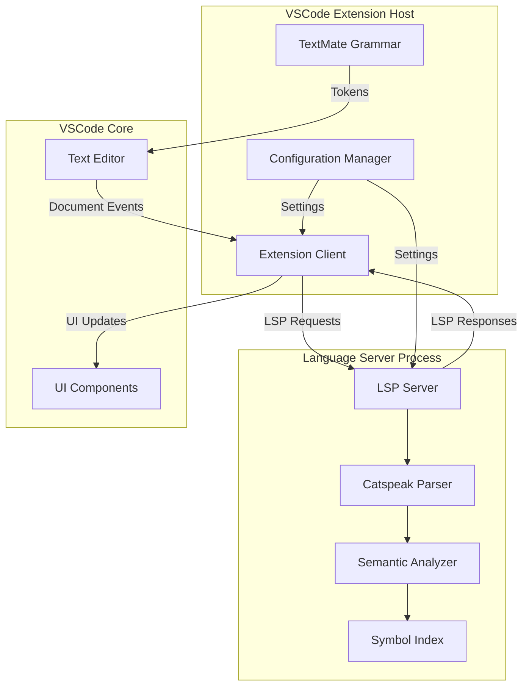

# Design Document: Catspeak VSCode Extension

## Overview

The Catspeak VSCode Extension provides comprehensive language support for the Catspeak scripting language within Visual Studio Code. The extension implements a two-tier architecture: a client-side extension that integrates with VSCode's extension API, and a language server that provides semantic analysis and language intelligence features via the Language Server Protocol (LSP).

### Key Design Goals

1. **Performance**: Provide responsive language features with minimal latency (syntax highlighting <100ms, completions <300ms, diagnostics <500ms)
2. **Accuracy**: Deliver precise semantic analysis for navigation, completion, and error detection
3. **Extensibility**: Design modular components that can be enhanced with additional language features
4. **User Experience**: Integrate seamlessly with VSCode's native UI and keyboard shortcuts

### Technology Stack

- **Extension Host**: TypeScript/JavaScript running in VSCode's extension host process
- **Language Server**: Node.js-based LSP server implementing the Language Server Protocol
- **Syntax Highlighting**: TextMate grammar (JSON/YAML format) for tokenization
- **Communication**: JSON-RPC over stdio for client-server communication
- **Testing**: Jest for unit tests, VSCode Extension Test Runner for integration tests

## Architecture

### High-Level Architecture



### Component Responsibilities

#### Extension Client
- Activates on .meow file open
- Manages language server lifecycle (start, stop, restart)
- Registers TextMate grammar for syntax highlighting
- Provides bracket matching, auto-closing, and comment toggling
- Forwards configuration changes to language server
- Handles UI interactions (go-to-definition, find references, etc.)

#### Language Server
- Maintains document state synchronized with client
- Performs lexical analysis and parsing
- Builds and maintains symbol index across workspace
- Provides language features: completion, hover, definition, references, diagnostics
- Implements semantic token provider for enhanced highlighting
- Handles workspace symbol search with fuzzy matching

#### TextMate Grammar
- Defines tokenization rules for Catspeak syntax
- Provides initial syntax highlighting (fast, regex-based)
- Covers keywords, literals, operators, comments, strings
- Independent of semantic analysis for immediate visual feedback

## Components and Interfaces

### Extension Client API

```typescript
interface CatspeakExtension {
  activate(context: vscode.ExtensionContext): Promise<void>;
  deactivate(): Promise<void>;
}

interface LanguageClientManager {
  startServer(): Promise<LanguageClient>;
  stopServer(): Promise<void>;
  restartServer(): Promise<void>;
  getClient(): LanguageClient | undefined;
}

interface ConfigurationManager {
  getConfiguration(): CatspeakConfiguration;
  onConfigurationChanged(handler: (config: CatspeakConfiguration) => void): void;
}

interface CatspeakConfiguration {
  semanticHighlighting: boolean;
  diagnosticSeverity: 'error' | 'warning' | 'hint';
  formatting: {
    indentSize: number;
    useTabs: boolean;
  };
  autoClosingBrackets: boolean;
}
```

### Language Server API (LSP)

The language server implements standard LSP methods:

```typescript
interface CatspeakLanguageServer {
  // Document Synchronization
  onDidOpenTextDocument(params: DidOpenTextDocumentParams): void;
  onDidChangeTextDocument(params: DidChangeTextDocumentParams): void;
  onDidCloseTextDocument(params: DidCloseTextDocumentParams): void;
  
  // Language Features
  onCompletion(params: CompletionParams): CompletionItem[];
  onHover(params: HoverParams): Hover | null;
  onDefinition(params: DefinitionParams): Location | Location[] | null;
  onReferences(params: ReferenceParams): Location[];
  onDocumentSymbol(params: DocumentSymbolParams): DocumentSymbol[];
  onWorkspaceSymbol(params: WorkspaceSymbolParams): SymbolInformation[];
  
  // Semantic Analysis
  onSemanticTokensFull(params: SemanticTokensParams): SemanticTokens;
  onSemanticTokensRange(params: SemanticTokensRangeParams): SemanticTokens;
  
  // Diagnostics
  publishDiagnostics(uri: string, diagnostics: Diagnostic[]): void;
}
```

### Parser Interface

```typescript
interface CatspeakParser {
  parse(source: string): ParseResult;
  parseIncremental(source: string, changes: TextChange[]): ParseResult;
}

interface ParseResult {
  ast: ASTNode;
  errors: ParseError[];
  tokens: Token[];
}

interface ASTNode {
  type: NodeType;
  range: Range;
  children: ASTNode[];
}

type NodeType = 
  | 'Program'
  | 'LetDeclaration'
  | 'FunctionExpression'
  | 'CallExpression'
  | 'BinaryExpression'
  | 'Identifier'
  | 'Literal'
  | 'IfStatement'
  | 'WhileStatement'
  | 'ReturnStatement'
  | 'MemberExpression';

interface Token {
  type: TokenType;
  value: string;
  range: Range;
}

type TokenType =
  | 'Keyword'
  | 'Identifier'
  | 'String'
  | 'Number'
  | 'Operator'
  | 'Comment'
  | 'Punctuation';
```

### Semantic Analyzer Interface

```typescript
interface SemanticAnalyzer {
  analyze(ast: ASTNode, uri: string): AnalysisResult;
  getSymbolAtPosition(uri: string, position: Position): Symbol | null;
  getReferences(uri: string, position: Position): Location[];
  getCompletions(uri: string, position: Position): CompletionItem[];
}

interface AnalysisResult {
  symbols: SymbolTable;
  diagnostics: Diagnostic[];
  semanticTokens: SemanticToken[];
}

interface SymbolTable {
  symbols: Map<string, Symbol>;
  scopes: Scope[];
}

interface Symbol {
  name: string;
  kind: SymbolKind;
  range: Range;
  declarationRange: Range;
  type?: string;
  documentation?: string;
}

type SymbolKind = 
  | 'Variable'
  | 'Function'
  | 'Parameter'
  | 'Property'
  | 'Keyword';

interface Scope {
  range: Range;
  parent: Scope | null;
  symbols: Map<string, Symbol>;
}
```

### Symbol Index Interface

```typescript
interface SymbolIndex {
  indexDocument(uri: string, symbols: Symbol[]): void;
  removeDocument(uri: string): void;
  findSymbol(name: string): Symbol[];
  findSymbolFuzzy(query: string): Symbol[];
  getDocumentSymbols(uri: string): Symbol[];
  getAllSymbols(): Symbol[];
}
```

## Data Models

### Document State

```typescript
interface DocumentState {
  uri: string;
  version: number;
  content: string;
  parseResult: ParseResult;
  analysisResult: AnalysisResult;
  lastModified: number;
}
```

### Diagnostic Model

```typescript
interface Diagnostic {
  range: Range;
  severity: DiagnosticSeverity;
  message: string;
  code?: string;
  source: 'catspeak';
}

enum DiagnosticSeverity {
  Error = 1,
  Warning = 2,
  Information = 3,
  Hint = 4
}
```

### Completion Model

```typescript
interface CompletionItem {
  label: string;
  kind: CompletionItemKind;
  detail?: string;
  documentation?: string;
  insertText?: string;
  sortText?: string;
  filterText?: string;
}

enum CompletionItemKind {
  Keyword = 14,
  Variable = 6,
  Function = 3,
  Property = 10,
  Snippet = 15
}
```

## Error Handling

### Extension Client Error Handling

1. **Server Startup Failures**
   - Log error details to output channel
   - Display user-friendly error notification
   - Provide fallback to syntax highlighting only
   - Offer manual restart option

2. **Communication Errors**
   - Implement automatic retry with exponential backoff
   - Log communication failures
   - Restart server after 3 consecutive failures
   - Notify user if restart fails

3. **Configuration Errors**
   - Validate configuration on change
   - Log validation errors
   - Fall back to default configuration
   - Display warning for invalid settings

### Language Server Error Handling

1. **Parse Errors**
   - Return partial AST for error recovery
   - Generate diagnostic messages with precise locations
   - Continue processing valid portions of document
   - Cache last valid parse result

2. **Analysis Errors**
   - Isolate errors to specific documents
   - Log internal errors without crashing server
   - Return empty results for failed operations
   - Maintain server availability

3. **Index Corruption**
   - Detect inconsistent index state
   - Rebuild index from scratch
   - Log corruption events
   - Notify client of rebuild progress

### Graceful Degradation

- If language server fails: fall back to TextMate grammar only
- If semantic analysis fails: provide syntactic features only
- If index is unavailable: search current document only
- If formatting fails: leave document unchanged

## Testing Strategy

### Unit Testing

**Focus Areas:**
- Parser correctness with valid and invalid Catspeak syntax
- Semantic analyzer symbol resolution logic
- Symbol index operations (add, remove, search, fuzzy matching)
- Configuration validation and transformation
- Token classification logic
- Diagnostic generation for specific error conditions

**Example Test Cases:**
- Parse valid function declarations and verify AST structure
- Parse invalid syntax and verify error messages
- Resolve symbol references within nested scopes
- Handle undefined variable references
- Fuzzy match symbol names with typos
- Validate configuration with invalid values

### Integration Testing

**Focus Areas:**
- Extension activation on .meow file open
- Language server startup and LSP communication
- Document synchronization between client and server
- End-to-end language features (completion, hover, definition)
- Configuration changes propagating to server
- Workspace indexing on project open

**Example Test Cases:**
- Open .meow file and verify extension activates within 200ms
- Type code and verify completions appear within 300ms
- Ctrl+Click on symbol and verify navigation to definition
- Modify configuration and verify server receives update
- Search workspace symbols and verify results from multiple files

### Performance Testing

**Benchmarks:**
- Syntax highlighting: <100ms for files up to 10,000 lines
- Completion response: <300ms
- Diagnostic analysis: <500ms for files up to 5,000 lines
- Go-to-definition: <500ms
- Workspace symbol search: <2000ms for workspaces with 1,000 files

### Manual Testing

**Scenarios:**
- Visual verification of syntax highlighting colors
- Bracket matching and auto-closing behavior
- Comment toggling with various selections
- Formatting output for complex code structures
- Error squiggles and hover messages
- Outline view updates on code changes

### Test Environment

- VSCode version: 1.60.0 and latest stable
- Node.js version: 14.x and 16.x
- Operating systems: Windows, macOS, Linux
- Sample Catspeak projects of varying sizes (small, medium, large)

## Implementation Notes

### TextMate Grammar Structure

The grammar will be defined in `syntaxes/catspeak.tmLanguage.json`:

```json
{
  "scopeName": "source.catspeak",
  "patterns": [
    { "include": "#keywords" },
    { "include": "#strings" },
    { "include": "#numbers" },
    { "include": "#comments" },
    { "include": "#operators" }
  ],
  "repository": {
    "keywords": {
      "patterns": [{
        "name": "keyword.control.catspeak",
        "match": "\\b(let|fun|if|else|while|for|return|break|continue|throw|catch|do|match|with|new|self|other|true|false|undefined|infinity|NaN|and|or|xor|impl|params|loop)\\b"
      }]
    }
  }
}
```

### Parser Implementation Strategy

1. **Lexical Analysis**: Tokenize source into keywords, identifiers, literals, operators
2. **Syntax Analysis**: Build AST using recursive descent parsing
3. **Error Recovery**: Use synchronization tokens (semicolons, braces) to continue parsing after errors
4. **Incremental Parsing**: Reuse unchanged AST subtrees when document changes

### Symbol Resolution Algorithm

1. **Scope Building**: Traverse AST and create scope hierarchy
2. **Symbol Collection**: Collect declarations in each scope
3. **Reference Resolution**: For each identifier, search enclosing scopes outward
4. **Cross-File Resolution**: Use symbol index for workspace-wide lookups

### Completion Ranking

Completion items are ranked by:
1. **Exact prefix match**: Highest priority
2. **Local symbols**: Variables and functions in current scope
3. **Document symbols**: Symbols from current file
4. **Workspace symbols**: Symbols from other files
5. **Keywords**: Language keywords
6. **Snippets**: Code templates

### Semantic Token Types

The extension will use these semantic token types:
- `namespace`: Module or namespace identifiers
- `class`: Struct or class names
- `function`: Function declarations
- `variable`: Variable declarations
- `parameter`: Function parameters
- `property`: Struct member access
- `keyword`: Language keywords
- `comment`: Comment text
- `string`: String literals
- `number`: Numeric literals

## Performance Considerations

### Optimization Strategies

1. **Lazy Parsing**: Parse documents only when language features are requested
2. **Incremental Updates**: Reparse only changed portions of documents
3. **Debouncing**: Delay analysis until user stops typing (300ms threshold)
4. **Caching**: Cache parse results, symbol tables, and analysis results
5. **Background Indexing**: Index workspace symbols asynchronously on startup
6. **Throttling**: Limit diagnostic updates to avoid overwhelming the UI

### Memory Management

- Limit symbol index size by pruning old entries
- Use weak references for cached parse results
- Clear analysis results for closed documents
- Implement LRU cache for frequently accessed documents

### Scalability

- Support workspaces with up to 10,000 .meow files
- Handle individual files up to 50,000 lines
- Maintain responsive UI even during full workspace indexing
- Use worker threads for CPU-intensive operations if needed

## Security Considerations

1. **Input Validation**: Sanitize all user input and file content before processing
2. **Path Traversal**: Validate file paths to prevent access outside workspace
3. **Resource Limits**: Enforce limits on file size, parse depth, and memory usage
4. **Sandboxing**: Run language server in separate process with limited privileges
5. **Dependency Security**: Regularly update dependencies and scan for vulnerabilities

## Deployment and Distribution

### Package Structure

```
catspeak-vscode-extension/
├── package.json
├── README.md
├── LICENSE
├── CHANGELOG.md
├── icon.png
├── syntaxes/
│   └── catspeak.tmLanguage.json
├── client/
│   ├── src/
│   │   ├── extension.ts
│   │   ├── languageClient.ts
│   │   └── configuration.ts
│   └── package.json
├── server/
│   ├── src/
│   │   ├── server.ts
│   │   ├── parser.ts
│   │   ├── analyzer.ts
│   │   └── index.ts
│   └── package.json
└── test/
    ├── unit/
    └── integration/
```

### Build Process

1. Compile TypeScript to JavaScript
2. Bundle dependencies using webpack
3. Generate .vsix package using vsce
4. Run tests before packaging
5. Validate package contents

### Installation Methods

1. **VSCode Marketplace**: Primary distribution channel
2. **Manual Installation**: Download .vsix and install via Extensions panel
3. **Development**: Clone repository and run in Extension Development Host

### Version Management

- Follow semantic versioning (MAJOR.MINOR.PATCH)
- Maintain CHANGELOG.md with release notes
- Tag releases in version control
- Support VSCode API version compatibility

## Future Enhancements

Potential features for future releases:
- Code refactoring (rename symbol, extract function)
- Code lens for function references
- Inlay hints for parameter names and types
- Debug adapter protocol support
- Catspeak REPL integration
- Project templates and scaffolding
- Integration with GameMaker Studio
- Performance profiling visualization
